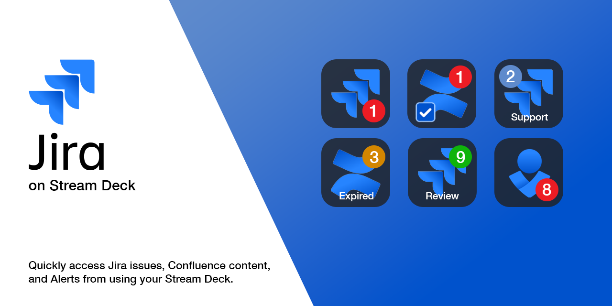
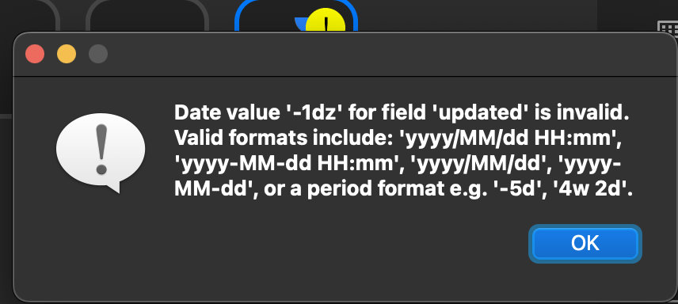

# Stream Deck Jira Plugin

A Stream Deck plugin for viewing the number of Jira issues matching a JQL query (i.e. the number of new issues or issues waiting for your feedback).

## Features
* Allows for multiple actions to be defined with different JQL queries
* Button icon shows the count of issues matching the query
* The button opens each matching issue in a separate browser window
* Many customization options for how the badge is displayed
* Allows for custom icons to be set

## Installation
### Preferred: Stream Deck Store
https://apps.elgato.com/plugins/com.mediabounds.streamdeck.jira

### Alternative: Manual installation
1. Download the latest release from <https://github.com/mediabounds/streamdeck-jira/releases>.
2. Go to your download folder and open `com.mediabounds.streamdeck.jira.streamDeckPlugin`.

## Configuration
### Global settings
* **Domain** -- the product URL for your Jira organization (i.e. `organization.atlassian.net`)
* **Email** -- the email address for your Atlassian account
* **API Token** -- an API token for your account which can be created at <https://id.atlassian.com/manage-profile/security/api-tokens>.

### JQL Result action
In addition to the **Global settings**, the JQL Result action also requires:
* **JQL** -- a query for filtering a list of issues.

Optionally, you may also customize how the icon is badged with the number of issues matching the JQL query.

## FAQ
### Can I choose my own icon?
Yep! But you'll want to upload a **Custom Image** in the **Icon** settings for the plugin instead of setting the icon through Streamdeck's icon library.

> **Note**  
> When a custom icon is set using Streamdeck's built-in interface or icon library, the plugin will no longer be able to add a badge on the icon. You can remove a custom icon set via Streamdeck by tapping the ˅ on the icon and selecting **Reset to Default**.

### Why do I get a yellow ! on the icon?
The yellow exclamation mark means that the plugin encountered some problem while trying to find the number of issues matching the JQL query. This could mean the API token isn't entered correctly, or there's a syntax error in the JQL, or just that there was some Internet connection problem while talking to the server.

Below the JQL field is a status indicator that'll confirm whether the plugin is able to communicate with Jira. When there is a problem, it will show a warning.

When you click on the status indicator, it will provide more details about what went wrong.

Need to debug more?

If you're sure all the configuration is correct but the connection is still not successful, you can alternate click (i.e. right-clicking) on the status message to get a more in-depth view at the response.

## License
The plugin is available as open source under the terms of the
[MIT License](https://opensource.org/licenses/MIT). A copy of the license can be
found at <https://github.com/mediabounds/streamdeck-jira/blob/main/LICENSE.md>.
